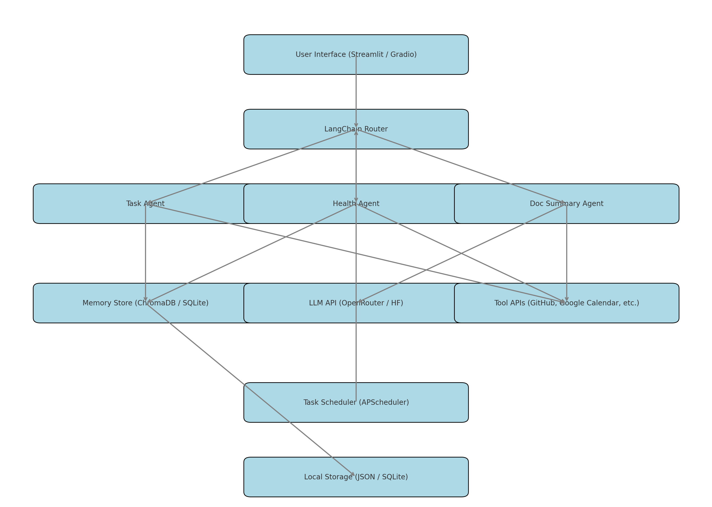

  # Your Life OS - AI Life Operating System (POC)

Your Life OS is a personal and organizational operating system—a comprehensive framework designed to help individuals and teams manage all aspects of their lives and work using intelligent, AI-driven support. This proof-of-concept demonstrates how intelligent agents, memory, and workflow automation can help you manage life and work.

  ---

  ## Architecture Overview

  
  <details>
  <summary>📄 View Architecture Description (click to expand)</summary>

  The system includes:
  - Streamlit UI for interaction
  - LangChain router to delegate tasks
  - Multiple agents for task, health, document processing
  - Memory store and scheduler

  🔗 [Full Architecture Description](./Architecture/Description/ArchitectureDescription.txt)
</details>

  ### System Components:
  - **Streamlit UI**: Chat-based user interface
  - **LangChain Router**: Determines which agent handles the input
  - **Agents**:
    - `Task Agent`: Handles reminders and to-dos
    - `Health Agent`: Responds to personal wellness queries (mocked)
    - `Doc Summary Agent`: Summarizes documents using LLMs
  - **Memory Store**: ChromaDB or SQLite for persistent knowledge
  - **LLM API**: OpenRouter or HuggingFace for natural language processing
  - **APScheduler**: For task scheduling and reminders
  - **Local Storage**: JSON/SQLite for offline state

  ---

  ## Features

  - Natural language interaction  
  - Persistent memory of notes, tasks, goals  
  - AI agents for productivity, docs, health  
  - Automated workflows and reminders  
  - Integrations via GitHub and Google APIs (planned)  

  ---

  ## Tech Stack

  | Layer           | Technology           |
  |----------------|----------------------|
  | UI             | Streamlit / Gradio   |
  | Agent Logic    | LangChain (Python)   |
  | LLM Access     | OpenRouter / HF API  |
  | Memory         | ChromaDB / SQLite    |
  | Scheduling     | APScheduler          |
  | Local Storage  | JSON / SQLite        |
  | Git Workflow   | GitFlow (main, develop, feature/*) |

  ---

  ## Project Structure
  your_life_os_poc/
  │
  ├── main.py # Entry point
  │
  ├── ui/
  │ └── app.py # Streamlit UI
  │
  ├── agents/
  │ ├── task_agent.py # Handles task-related prompts
  │ ├── health_agent.py # Mocked health assistant
  │ └── doc_agent.py # Summarization agent
  │
  ├── api/
  │ └── router.py # LangChain-style input router
  │
  ├── memory/
  │ └── store.py # Save/load user data (JSON or SQLite logic here)
  │
  ├── scheduler/
  │ └── tasks.py # APScheduler jobs
  │
  ├── utils/
  │ └── helpers.py # Utility functions
  │
  ├── Architecture/
  │ ├── Image/
  │ │ └── Architecture.png # Architecture diagram image
  │ └── Description/
  │ └── ArchitectureDescription.txt # Architecture breakdown in text
  │
  └── data/
  └── README.md # Placeholder for static files

  ---

  ### Getting Started

  ---
  ### 1. Clone the Repository

  ```bash
  git clone https://github.com/HEMASAI1708/your_life_os_poc
  cd your_life_os_poc
  ```
  # more details needs to be added here.
  ---

  ## Roadmap

  - [x] Setup base project with Streamlit UI and LangChain routing
  - [x] Implement Task and Health agents
  - [x] LLM summarizer via OpenRouter
  - [x] Add memory support (SQLite/ChromaDB)
  - [x] Integrate Google Calendar API
  - [x] Add Notion and GitHub integrations
  - [x] Enable multi-agent conversations
  - [x] Deploy to Streamlit Cloud


  ---

  ## Author

  Built with ❤️ by [HEMA SAI DUPPALAPUDI](https://github.com/HEMASAI1708)

  ---

  ## License

  This project is licensed under the MIT License. See the [LICENSE](./LICENSE) file for details.